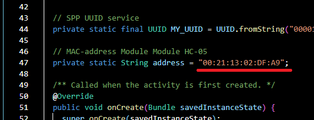
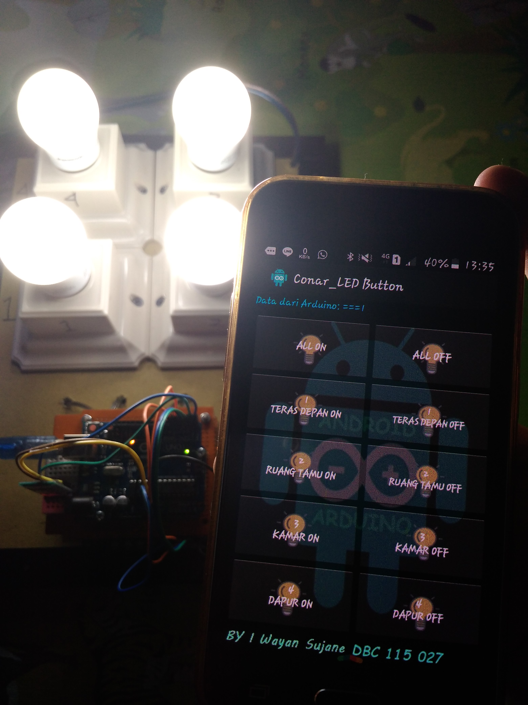
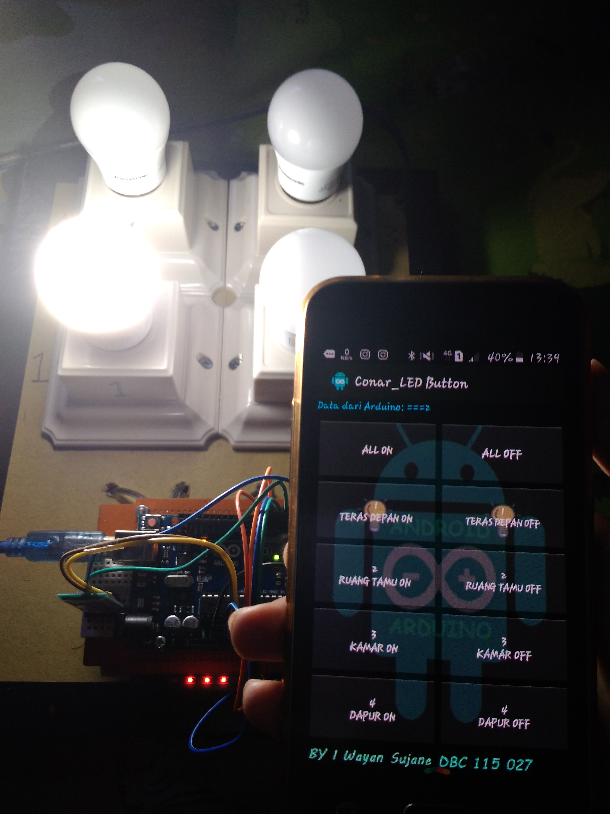
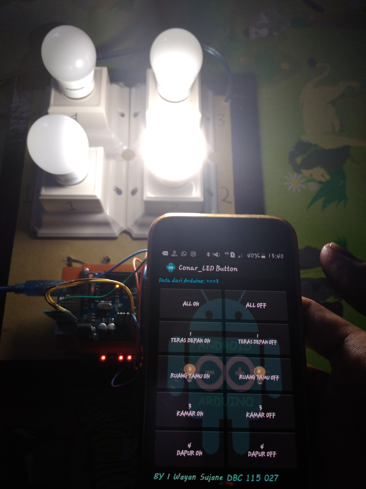
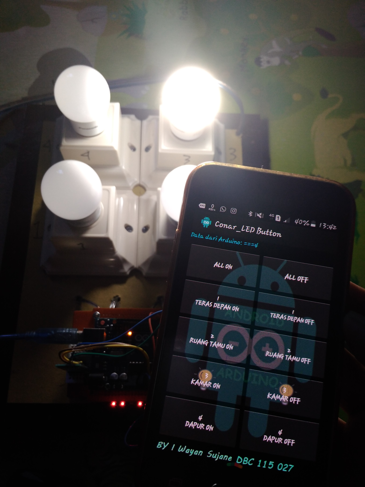
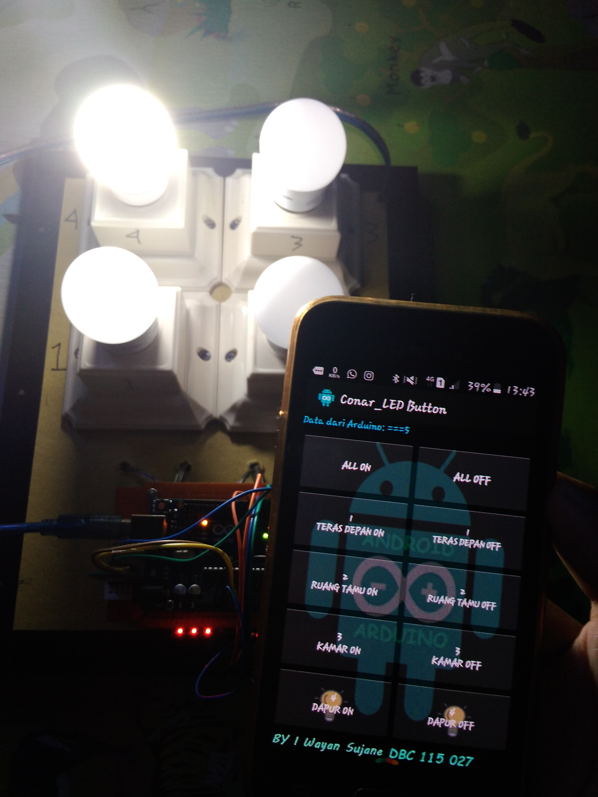

# Android-Conar_LED™-Lamp-Control
Aplikasi Android Conar_LED™ kontrol lampu via koneksi Bluetooth Arduino. 
PROGRAMMING USE ANDROID STUDIO.

## 📝 NOTE
- **Source Code Program Arduinonya: [Code Arduino Conar_LED™](https://github.com/wayan-wynz/INO-Arduino-Bluetooth-Lamp-Control) by Wynz**  
- **Aplikasi Ini versi BETA percobaan, silahkan dikembangkan 😁.**
- **In this version, sesuaikan MAC ADDRESS modul Bluetooth HC-05 anda pada code MainActivity dan lakukan Build kembali. **
**Location : `Conar_LED11\app\src\main\java\com\wynz\conarled\MainActivity.java` **
- **Interface Aplikasi **

